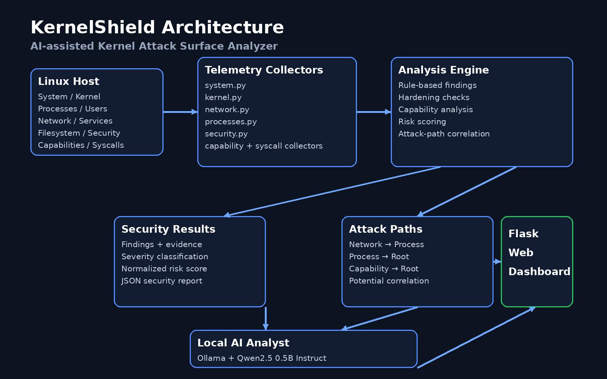
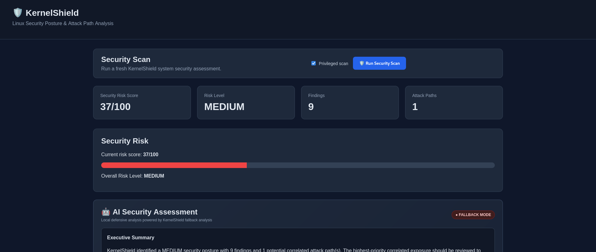
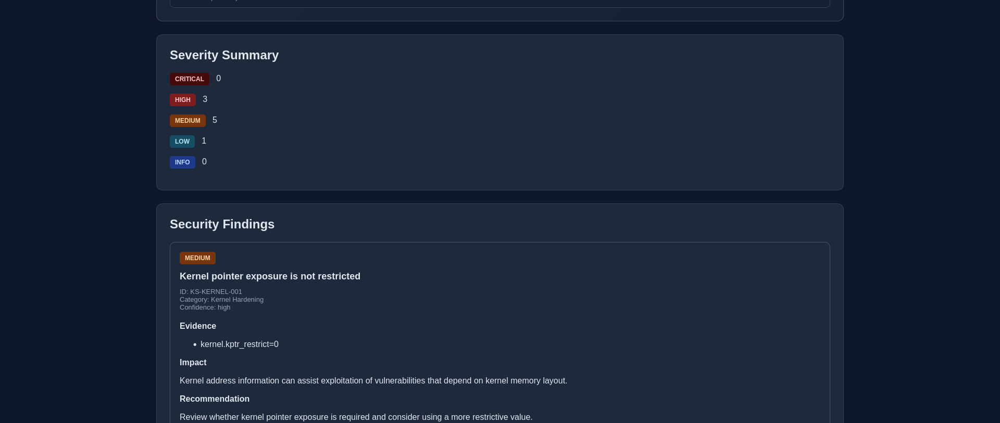
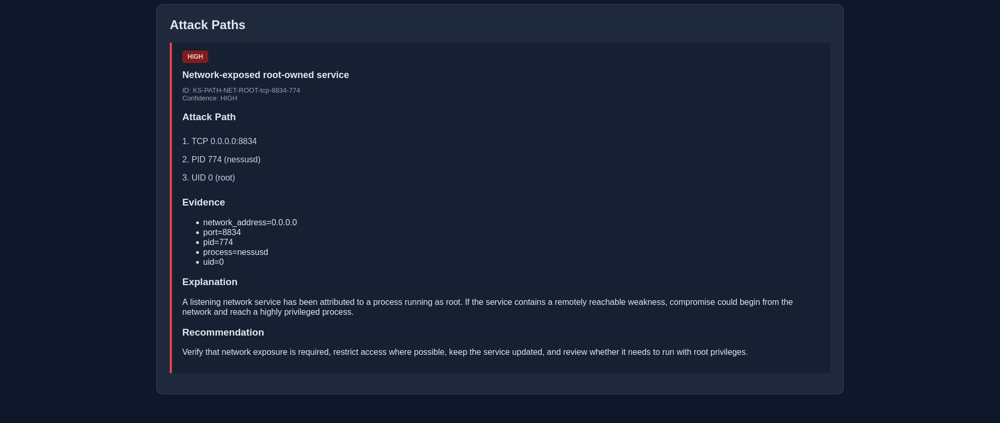
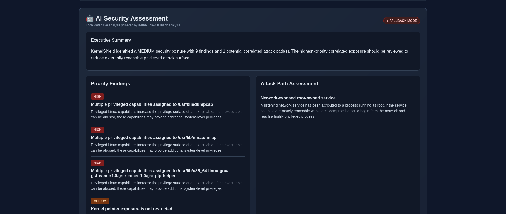

# 🛡️ KernelShield

### AI-assisted Kernel Attack Surface Analyzer

KernelShield is a Linux security posture and kernel attack-surface analyzer developed for the **C-DAC National Level SSM Hackathon 2026**.

It combines deterministic Linux host telemetry, security-hardening checks, capability analysis, process/network correlation, risk scoring, attack-path detection, and local AI-assisted defensive interpretation.

---

## 🎯 Problem Statement

**AI-assisted Kernel Attack Surface Analyzer**

The objective is to identify exposed kernel and system attack surfaces, detect security-hardening gaps, correlate multiple observations into potential attack paths, calculate risk, and provide an understandable defensive assessment.

---

## 🚀 Features

- Linux system and kernel information collection
- Kernel hardening/security parameter analysis
- Loaded kernel module and interface visibility
- Network listening socket analysis
- Service exposure detection
- User and UID 0 account analysis
- Filesystem security inspection
- Security-control assessment
- Container environment detection
- Process analysis
- Linux capability analysis
- Capability-to-risk correlation
- Seccomp/system-call security posture analysis
- Rule-based security findings
- Risk scoring and severity classification
- Network-to-root attack-path correlation
- Privileged scanning mode
- JSON security reports
- Web-based security dashboard
- Live standard and privileged scans
- Local AI-assisted security assessment

---

## 🧠 AI Architecture

KernelShield uses a **deterministic-first architecture**.

The security engine remains authoritative for:

- Findings
- Severity
- Risk score
- Evidence
- Attack paths

The AI layer is used only for defensive interpretation, prioritization, explanation, and recommendations.

This prevents the language model from inventing vulnerabilities, CVEs, processes, services, exploitability claims, or attack paths.

### Local AI

- Provider: Ollama
- Model: Qwen2.5 0.5B Instruct
- Execution: Local / CPU
- External AI API: Not required

If the local AI service is unavailable, KernelShield falls back to a deterministic security assessment.

---\n\n## 🏗️ Architecture

## 📸 Dashboard Preview

### Security Dashboard

### Security Findings

### Attack Path Analysis

### AI Security Assessment

